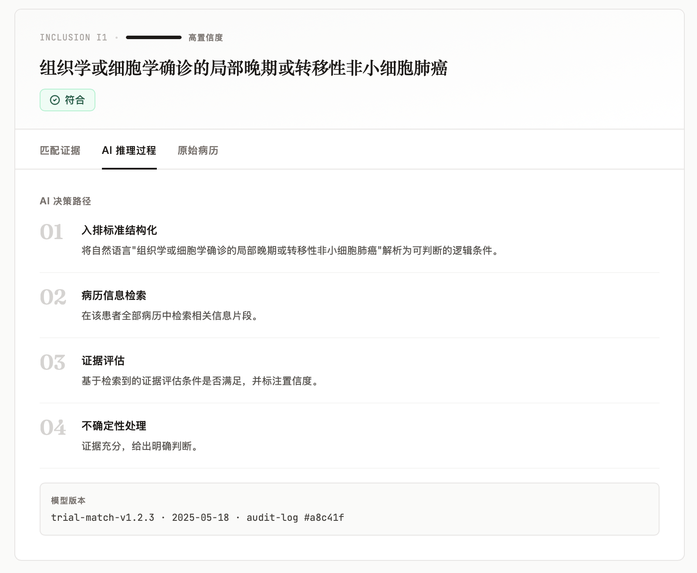
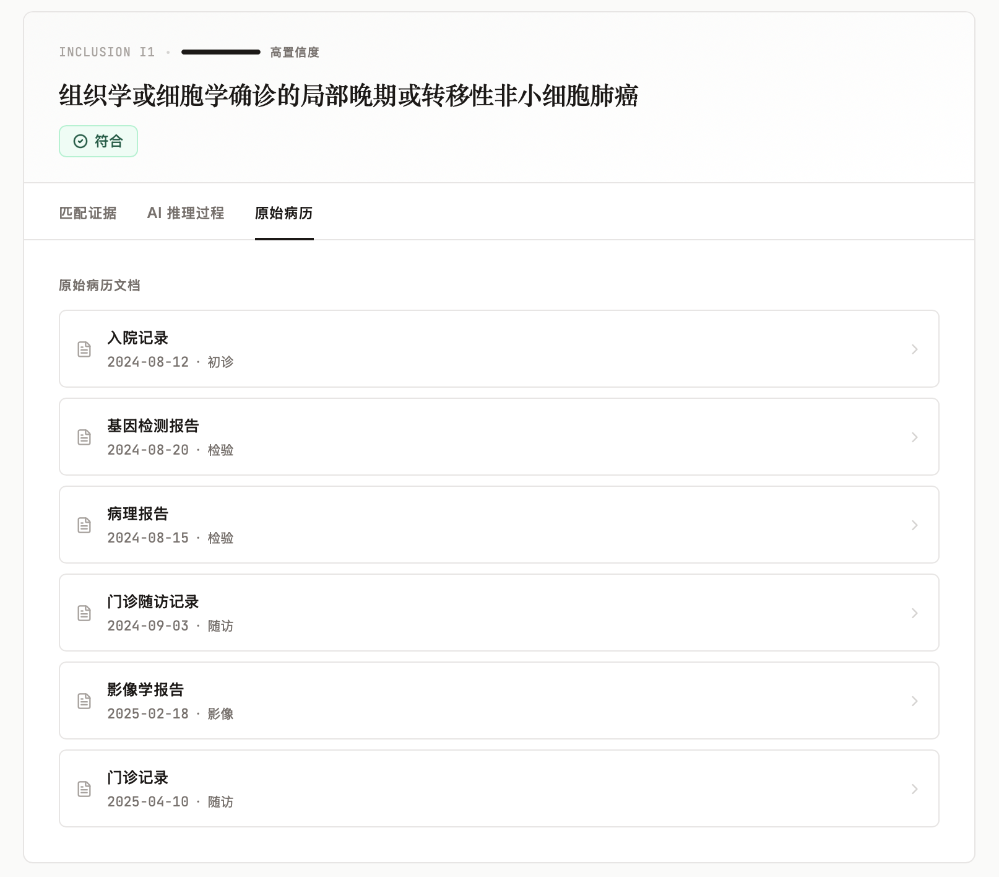
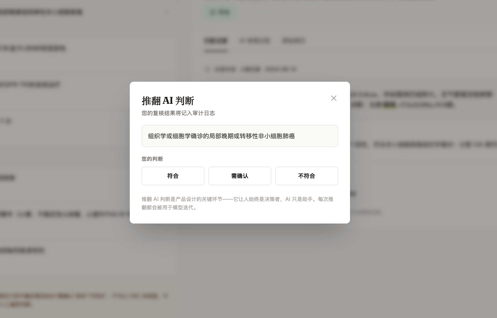
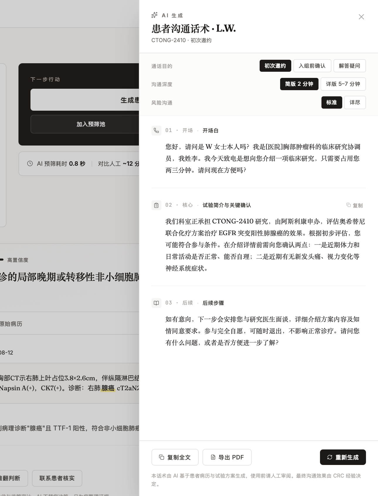

# TrialMatch

**CRC 工作台 · 临床试验智能预筛工具**


<br/>


---

## 项目背景 | Background

**临床研究协调员（CRC）** 每天要在 HIS 系统中手动逐一核对患者病历与入排标准——一个试验动辄几十条条款，翻阅一位患者平均需要 20–30 分钟。这套流程既低效，又容易因疲劳遗漏关键信息，直接影响入组速度与数据质量。

**TrialMatch** 是一个面向 CRC 的 AI 预筛工作台原型。它将 LLM 与结构化病历数据结合，在秒级完成初筛，并以"三态判断 + 证据链"的形式呈现结果，让 CRC 的精力聚焦在真正需要人工判断的模糊项上——而非重复的信息检索。

> This is a PM portfolio demo illustrating how AI can augment (not replace) the clinical research coordinator's pre-screening workflow. All patient data is simulated; no real patient information is used.

---

## 核心功能 | Key Features

- ✅ **AI 批量预筛** — 0.9 秒 / 人，17 名候选患者全量完成初步匹配
- ✅ **三态判断可视化** — 符合 / 需确认 / 不符合，附完整证据链与原始病历引用
- ✅ **CRC 可推翻 AI 判断** — 人工审核流程不被算法绑架，符合 GCP 合规要求
- ✅ **AI 推理可追溯** — 模型版本、Prompt 版本、置信度均有记录
- ✅ **患者沟通话术生成** — 按通话目的（邀约 / 确认 / 答疑）和话术深度自动生成结构化话术，支持按段复制
- ✅ **三层可解释性** — 从最终判断 → 推理步骤 → 原始病历，全程可追溯

---

## 技术栈 | Tech Stack

| 层级 | 技术 |
|------|------|
| 前端框架 | React 19 + Vite 6 |
| 样式 | TailwindCSS 3（stone 色系，无渐变） |
| 路由 | React Router v7 |
| 图标 | lucide-react |
| 字体 | Fraunces（展示）/ JetBrains Mono（数据）/ Inter（正文） |
| 截图生成 | Puppeteer（生成产品流程图） |

---

## 产品截图 | Screenshots

| | |
|---|---|
|  |  |
| ① 候选列表 — AI 0.8 秒筛出 17 人 | ② 匹配详情 — 证据链 + 三态判断 |
|  |  |
| ③ AI 推理 — 模型版本可追溯 | ④ 原始病历 — 三层可解释性 |
|  |  |
| ⑤ 推翻判断 — AI 不替人决策 | ⑥ 沟通话术 — 工作流延伸 |

---

## 本地运行 | Local Development

```bash
git clone https://github.com/yueyao-w/trialmatch.git
cd trialmatch
npm install
npm run dev
```

访问 `http://localhost:5173` 即可查看演示。

---

## 说明 | Disclaimer

本项目为 **产品经理作品集演示**，所有患者数据均为模拟生成，不涉及任何真实患者信息。界面设计与交互逻辑仅用于展示产品思路，不代表已上线产品。

> This is a product manager portfolio project. All patient data is synthetic. The design and interactions are for demonstration purposes only.

---

## 联系 | Contact

**王钥瑶**  
wyueyao02@163.com  
GitHub: [@yueyao-w](https://github.com/yueyao-w)

<sub>TrialMatch · Demo for PM Portfolio · 2026-05</sub>
